# ⚡ WordPress on AWS — Production Auto-Scaling Infrastructure

<div align="center">


**I built a production-grade WordPress infrastructure on AWS that auto-scales from 2 to 10 servers based on real traffic.**
**It handles 10x traffic spikes automatically with zero downtime.**

[Architecture](#-architecture) • [Tech Stack](#-tech-stack) • [Features](#-key-features) • [Setup](#-deployment-guide) • [Monitoring](#-monitoring--alerts) • [Results](#-results) • [Screenshots](#-screenshots)

</div>

---

## 📌 What I Built

I wanted to go beyond a basic WordPress install and build something that reflects how real companies host their websites on AWS. Instead of a single server that crashes under load, I architected a fully automated, self-healing infrastructure that detects traffic spikes and launches new servers within 2 minutes — then removes them when traffic drops to save cost.

This took me about 2 weeks to complete, working through each layer of the stack one phase at a time — from networking and security all the way to monitoring and load testing.

### The Problem I Was Solving

| Single Server (Before) | My Architecture (After) |
|------------------------|-------------------------|
| Crashes under high traffic | Auto-scales up to 10 servers |
| Single point of failure | Multi-AZ high availability |
| Files out of sync across servers | Shared EFS storage |
| Manual database management | Managed RDS with automated backups |
| No visibility into performance | CloudWatch dashboard + 4 alarms |
| Always paying for peak capacity | Pay only for what you use |

---

## 🏗️ Architecture

I designed the architecture in layers — each layer isolated from the others using security groups, with traffic only flowing in one direction through the stack.

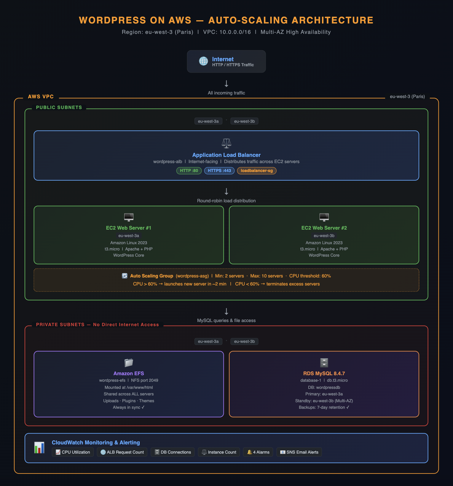

### Security Architecture — Defense in Depth

I implemented a 3-layer security model where each service can only talk to the layer directly next to it. The database is completely invisible to the internet.

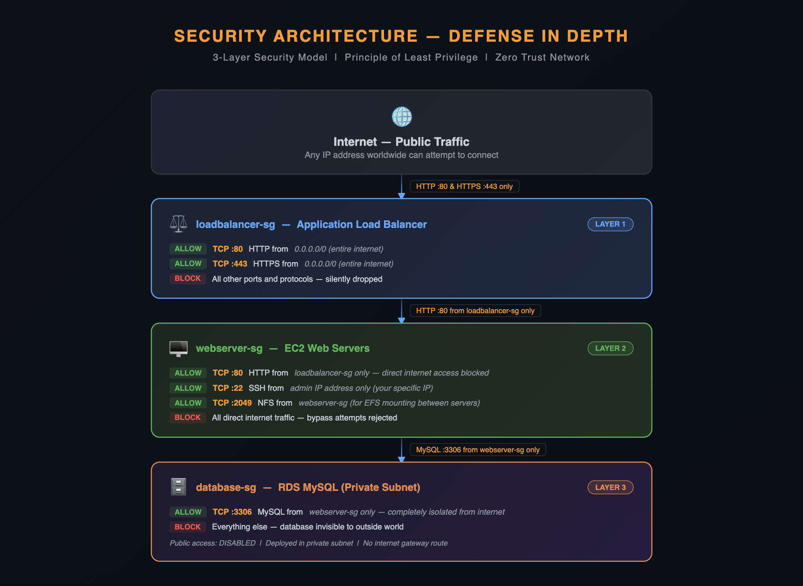

---

## 🛠️ Tech Stack

| Service | Role | How I Configured It |
|---------|------|---------------------|
| **VPC** | Private isolated network | 10.0.0.0/16 · 2 AZs · 4 subnets |
| **EC2** | WordPress web servers | Amazon Linux 2023 · t3.micro · Apache + PHP |
| **RDS** | Managed MySQL database | MySQL 8.4.7 · db.t3.micro · Multi-AZ |
| **EFS** | Shared file system | Mounted at /var/www/html on all servers |
| **ALB** | Load balancer | Application · Internet-facing · HTTP→HTTPS |
| **Auto Scaling** | Traffic-based scaling | Min: 2 · Max: 10 · CPU target: 60% |
| **NAT Gateway** | Private subnet outbound | Regional · Allows RDS updates securely |
| **CloudWatch** | Monitoring & alerting | Dashboard + 4 alarms + SNS email |
| **IAM** | Access management | Least privilege · No root account usage |

---

## ✨ Key Features

### 🔄 Automatic Scaling

I configured the Auto Scaling Group to monitor average CPU across all running instances. When traffic increases this is what happens automatically — no manual intervention needed:

```
Normal traffic    →  2 EC2 instances running
Traffic spike     →  CPU exceeds 60% threshold
                  →  ASG launches new EC2 from my AMI
                  →  New server ready in ~2 minutes
                  →  Load balancer adds it to rotation
Traffic drops     →  CPU falls below threshold
                  →  ASG terminates extra servers
                  →  Cost returns to baseline
```

### 🗄️ Multi-AZ High Availability

I deployed every critical layer across two Availability Zones. If AWS has a problem in one zone, the other zone keeps serving traffic with zero downtime:

```
eu-west-3a                    eu-west-3b
──────────────────────        ──────────────────────
EC2 Web Server #1             EC2 Web Server #2
RDS Primary Database          RDS Standby Replica
EFS Mount Target              EFS Mount Target
Public Subnet                 Public Subnet
Private Subnet                Private Subnet

If eu-west-3a fails → eu-west-3b continues serving traffic
RDS automatically promotes standby → no data loss
```

### 📁 Shared EFS Storage

This was one of the trickiest parts to understand. Without EFS, a multi-server WordPress setup breaks immediately:

```
Problem without EFS:
  User uploads photo → Server 1 saves it locally
  Next request → Load balancer routes to Server 2
  Server 2 → "Photo not found" → 404 error ❌

My solution with EFS:
  All servers mount the same /var/www/html directory
  Server 1 saves photo → Server 2 sees it instantly
  WordPress plugins, themes, uploads always in sync ✅
```

### 📊 CloudWatch Monitoring

I set up 4 production alarms covering the most important failure scenarios:

| Alarm | Metric | Threshold | Action |
|-------|--------|-----------|--------|
| wordpress-high-cpu | EC2 CPUUtilization | > 80% for 5 min | SNS Email |
| wordpress-low-healthy-hosts | ALB HealthyHostCount | < 2 | SNS Email |
| wordpress-rds-storage-low | RDS FreeStorageSpace | < 5 GB | SNS Email |
| wordpress-rds-connections-high | RDS DatabaseConnections | > 100 | SNS Email |

---

## 📁 Repository Structure

```
wordpress-aws-autoscaling/
│
├── README.md
│
├── architecture/
│   ├── 01-architecture.png          ← Full architecture diagram
│   └── 02-security.png              ← Security layers diagram
│
├── config/
│   └── wp-config-template.php       ← WordPress config template (no credentials)
│
├── scripts/
│   ├── install-wordpress.sh         ← EC2 setup script
│   └── user-data.sh                 ← ASG launch template startup script
│
└── screenshots/
    ├── 01-vpc-created.png
    ├── 02-security-groups.png
    ├── 03-rds-available.png
    ├── 04-efs-mount-targets.png
    ├── 05-wordpress-success-screen.png
    ├── 06-mysql-show-tables&users.png
    ├── 07-wordpress-running.png
    ├── 08-alb-active.png
    ├── 09-target-group-healthy.png
    ├── 10-asg-created.png
    ├── 11-cloudwatch-dashboard.png
    ├── 12-cloudwatch-alarms.png
    ├── 13-autoscaling-proof.png
    └── 14-asg-activity.png
```

---

## 🚀 Deployment Guide

Here's exactly how I built it, phase by phase.

### Prerequisites
- AWS Account (free tier works for most of this)
- AWS CLI configured locally
- SSH key pair downloaded
- Domain name (optional, needed for HTTPS)

### Phase 1 — VPC & Networking

I started by building the private network before touching anything else. The VPC wizard handles most of it automatically:

```bash
# VPC Settings I used:
Name: wordpress-vpc
CIDR: 10.0.0.0/16
AZs: 2
Public subnets: 2
Private subnets: 2
NAT Gateway: 1 (Regional)
```

Then I created 3 security groups — one for each layer of the architecture:

```
loadbalancer-sg   HTTP 80, HTTPS 443 from 0.0.0.0/0
webserver-sg      HTTP 80 from loadbalancer-sg | SSH 22 from my IP only
database-sg       MySQL 3306 from webserver-sg only
```

I also added this NFS rule to webserver-sg — I missed it at first and EFS mounting failed:
```
NFS 2049 from webserver-sg (required for EFS mounting)
```

### Phase 2 — RDS Database

I created the database before the EC2 server because WordPress asks for the DB connection details during setup:

```
Engine:         MySQL 8.0
Instance:       db.t3.micro
Storage:        20 GiB gp2
Multi-AZ:       Yes (db instance — not cluster, Paris only has 3 AZs)
VPC:            wordpress-vpc
Subnet Group:   private subnets only
Public Access:  No
Security Group: database-sg
DB Name:        wordpressdb
```

> ⚠️ **Mistake I made:** I initially selected Multi-AZ DB **cluster** which needs 3 AZs. Paris (eu-west-3) only has 3 AZs but my subnet group only had 2 private subnets. The fix was switching to Multi-AZ DB **instance** which only needs 2 AZs.

### Phase 3 — EFS Shared Storage

```
Name:           wordpress-efs
VPC:            wordpress-vpc
Mount Targets:  private subnets in both AZs
Security Group: webserver-sg
```

### Phase 4 — EC2 + WordPress Installation

```bash
# Launch EC2
AMI: Amazon Linux 2023
Type: t3.micro
Subnet: public subnet
Security Group: webserver-sg

# SSH into server
ssh -i your-key.pem ec2-user@<ec2-public-ip>

# Install dependencies
sudo dnf update -y
sudo dnf install -y httpd php php-mysqlnd php-fpm php-json php-xml php-mbstring
sudo dnf install -y amazon-efs-utils

# Mount EFS
sudo mkdir -p /var/www/html
sudo mount -t efs fs-XXXXXXXX:/ /var/www/html
echo "fs-XXXXXXXX:/ /var/www/html efs defaults,_netdev 0 0" | sudo tee -a /etc/fstab

# Install WordPress
cd /tmp
wget https://wordpress.org/latest.tar.gz
tar -xzf latest.tar.gz
sudo cp -r wordpress/* /var/www/html/
sudo chown -R apache:apache /var/www/html/

# Start Apache
sudo systemctl start httpd
sudo systemctl enable httpd
```

Configure wp-config.php with the RDS endpoint:
```php
define('DB_NAME',     'wordpressdb');
define('DB_USER',     'wpuser');
define('DB_PASSWORD', 'your-password');
define('DB_HOST',     'your-rds-endpoint.eu-west-3.rds.amazonaws.com');
```

### Phase 5 — Application Load Balancer

```
Name:     wordpress-alb
Scheme:   Internet-facing
VPC:      wordpress-vpc
Subnets:  both public subnets
SG:       loadbalancer-sg

Target Group:
  Name:         wordpress-tg
  Protocol:     HTTP port 80
  Health check: /wp-login.php
```

### Phase 6 — Auto Scaling Group

First I took a snapshot (AMI) of my working EC2 — this becomes the blueprint for every new server Auto Scaling launches:

```bash
# Create AMI from working EC2
Actions → Image → Create Image
Name: wordpress-ami-v1
No reboot: checked  ← keeps the site live during snapshot

# Launch Template User Data — runs automatically on every new server
#!/bin/bash
mount -t efs fs-XXXXXXXX:/ /var/www/html
systemctl start httpd
systemctl enable httpd
```

```
Auto Scaling Group:
  Name:     wordpress-asg
  Template: wordpress-lt
  VPC:      wordpress-vpc
  Subnets:  both public subnets
  ALB:      attach to wordpress-tg
  Min:      2
  Desired:  2
  Max:      10
  Policy:   Target Tracking — CPU 60%
```

### Phase 7 — CloudWatch Monitoring

```
Dashboard: wordpress-production
Widgets:
  - EC2 CPUUtilization (by ASG)
  - ALB RequestCount
  - RDS DatabaseConnections
  - ASG GroupTotalInstances

Alarms:
  - wordpress-high-cpu          CPU > 80%
  - wordpress-low-healthy-hosts Hosts < 2
  - wordpress-rds-storage-low   Storage < 5GB
  - wordpress-rds-connections   Connections > 100
```

---

## 📊 Monitoring & Alerts

### CloudWatch Dashboard

I built a dashboard with 4 widgets that give me a complete picture of the system at a glance:

| Widget | Metric | Why I Added It |
|--------|--------|----------------|
| CPU Utilization | EC2 average CPU | This is what triggers auto-scaling at 60% |
| Request Count | ALB requests/min | Shows how much traffic is hitting the site |
| DB Connections | Active RDS connections | Catches connection pool issues early |
| Instance Count | Servers in service | Confirms scaling actually happened |

### Load Test Results

I ran a load test using Apache Benchmark to prove the auto-scaling works in real life:

```bash
ab -n 10000 -c 100 http://wordpress-alb-xxx.eu-west-3.elb.amazonaws.com/

# What I observed:
CPU spike:        0% → 68.51% peak
DB connections:   0 → 56 peak
Instances:        2 → 3 (auto-scaled automatically)
Scale time:       ~2 minutes
```

The CloudWatch dashboard captured the whole event — CPU spike, database connections jumping, and the instance count going from 2 to 3.

---

## 💰 Cost Analysis

### What I Spent During This Project

| Service | Cost/Month | Notes |
|---------|-----------|-------|
| EC2 (2x t3.micro) | ~$0 | Covered by free tier |
| RDS db.t3.micro Multi-AZ | ~$33 | Standby replica doubles cost |
| EFS | ~$3 | Minimal data stored |
| ALB | ~$18 | Fixed hourly + per-request |
| NAT Gateway | ~$32 | Most expensive — bills even when idle |
| Route 53 | ~$1 | Hosted zone fee |
| **Full production total** | **~$87/month** | |

I had $180 in AWS credits so the actual out-of-pocket cost was $0. I deleted everything after completing and documenting the project.

### How to Cut Costs When Learning

```
Skip Multi-AZ on RDS     → saves ~$16/month
Skip NAT Gateway         → saves ~$32/month
Estimated learning cost  → ~$21/month

Most important habit: delete NAT Gateway and RDS
when taking a break of 2+ days — they bill even when idle.
```

---

## 📈 Results

| Metric | Single Server | My AWS Architecture |
|--------|--------------|---------------------|
| Max concurrent users | ~50 | Unlimited (scales automatically) |
| Traffic spike handling | Server crash | New server online in ~2 min |
| Availability | Single AZ only | Multi-AZ (99.99% uptime design) |
| File sync across servers | Breaks immediately | EFS keeps everything in sync |
| Database management | Manual backups | Automated 7-day retention |
| Monitoring | None | 4 alarms + live dashboard |
| Cost efficiency | Pay for peak always | Pay only for what you use |

---

## 📸 Screenshots

### Phase 1 — VPC & Security Groups

**VPC created — subnets, route tables, NAT gateway all provisioned by the wizard:**
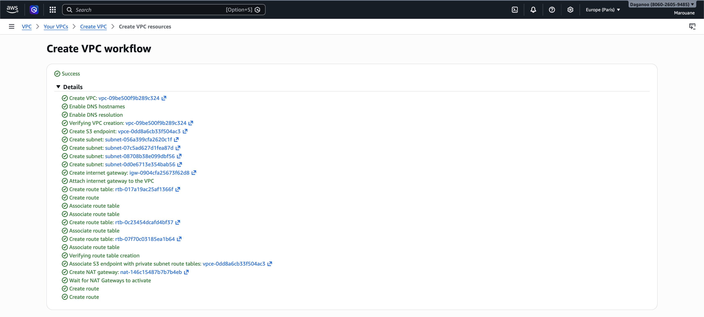

**3 security groups — one per layer of the architecture:**
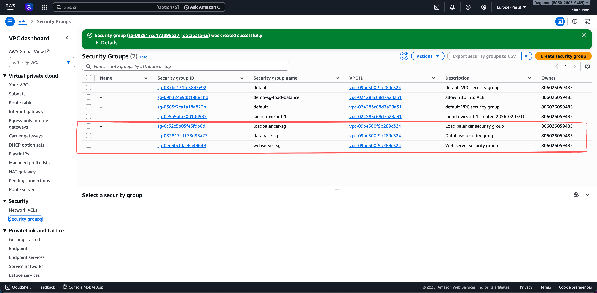

---

### Phase 2 — RDS Database

**RDS showing Available with Multi-AZ confirmed — primary in eu-west-3a, standby in eu-west-3b:**
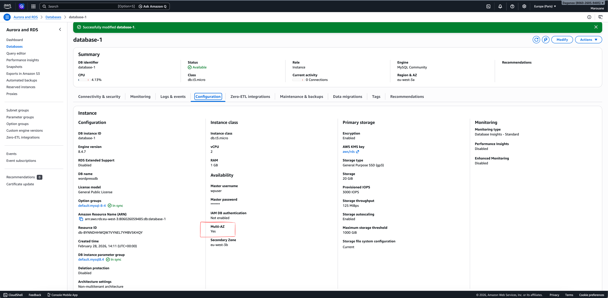

---

### Phase 3 — EFS Shared Storage

**EFS with mount targets in both AZs — both showing Available:**
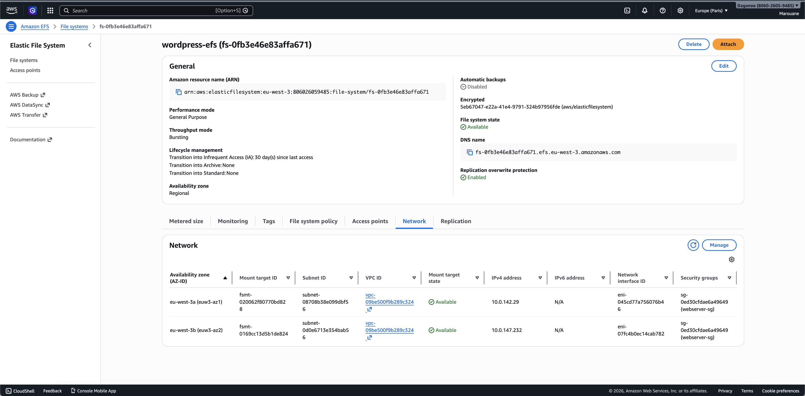

---

### Phase 4 — WordPress Installation

**WordPress setup screen — connected to RDS through the private subnet:**
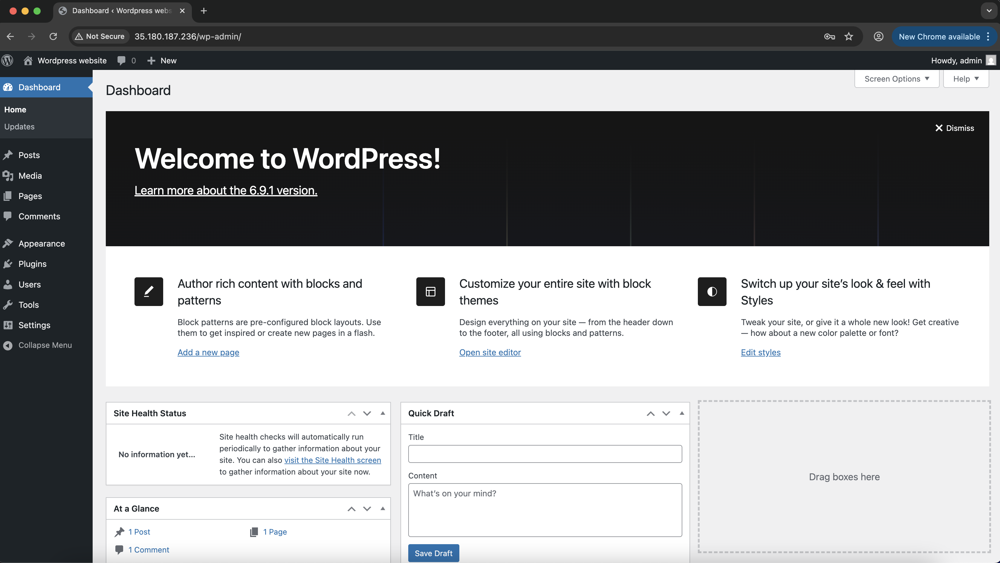

**MySQL tables confirmed — WordPress database installed correctly:**
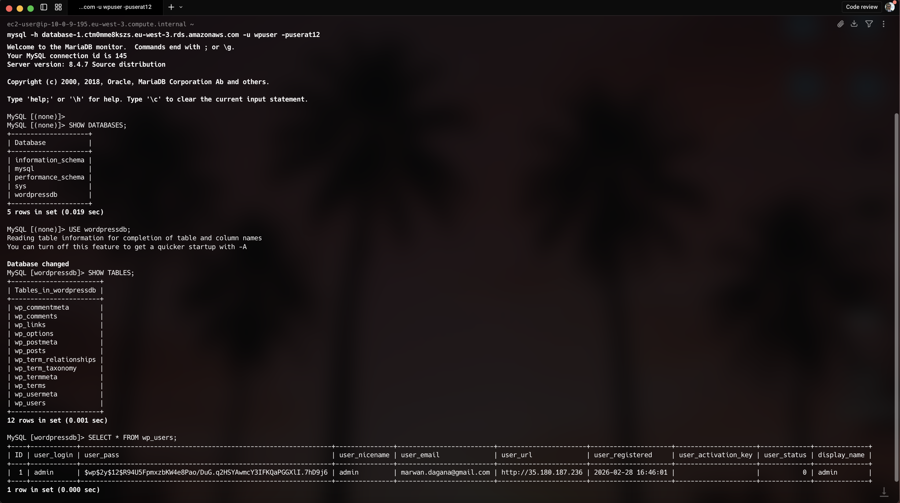

---

### Phase 5 — Load Balancer

**WordPress running through the ALB URL — not the EC2 IP directly:**
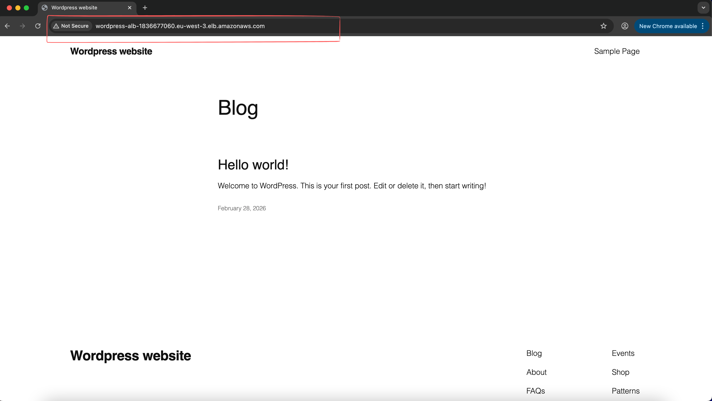

**ALB showing Active state:**
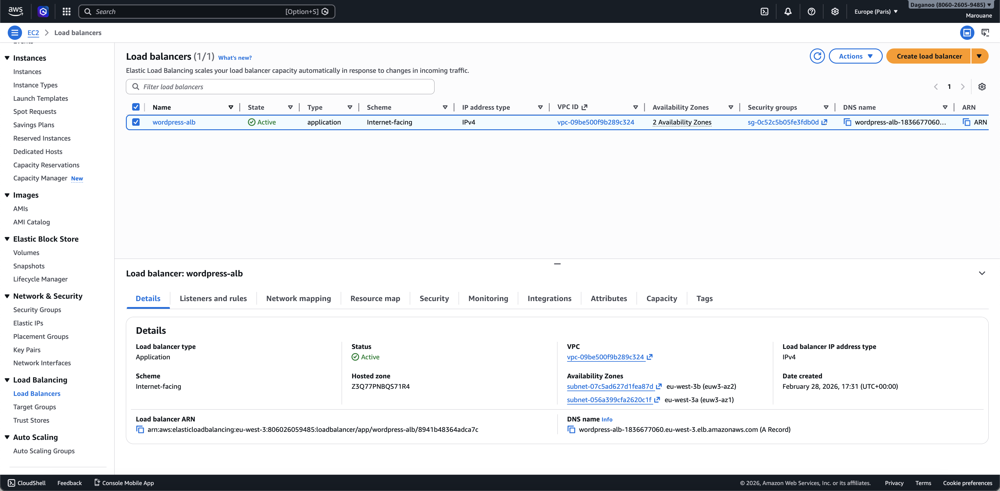

**Target group health check passing — WordPress responding correctly:**
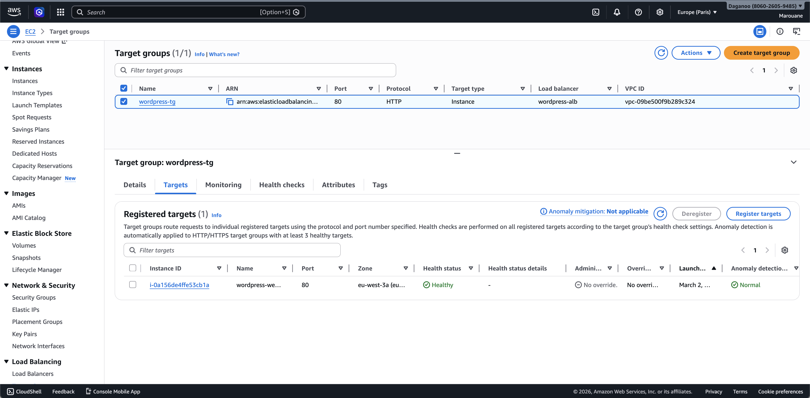

---

### Phase 6 — Auto Scaling

**Auto Scaling Group configured — min 2, max 10, CPU policy at 60%:**
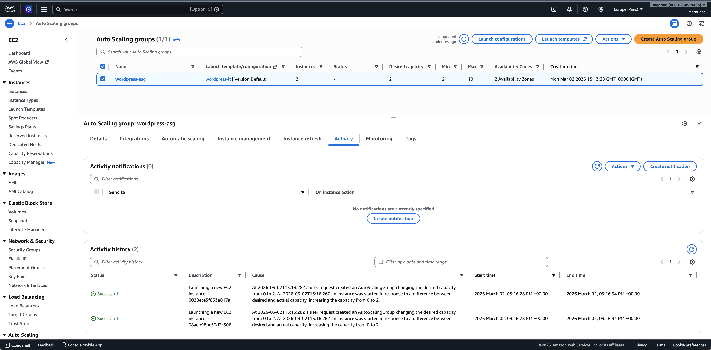

---

### Phase 7 — CloudWatch Monitoring

**Live dashboard showing all 4 metrics:**
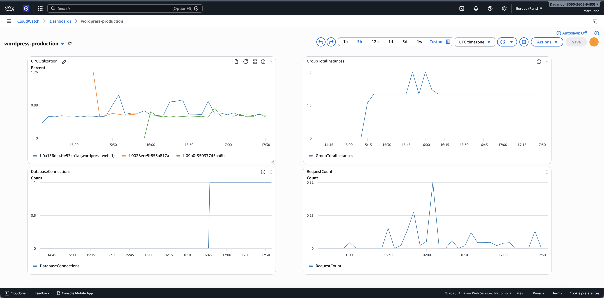

**All 4 alarms in OK state — system healthy:**
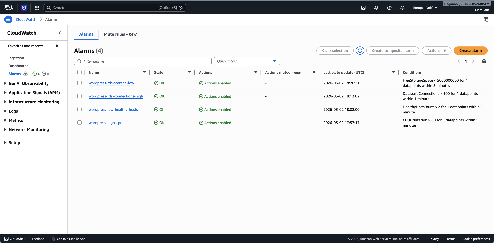

---

### Phase 8 — Auto-Scaling Proof 🎯

**The money shot — CPU hitting 68.51%, DB connections spiking, instance count going to 3:**
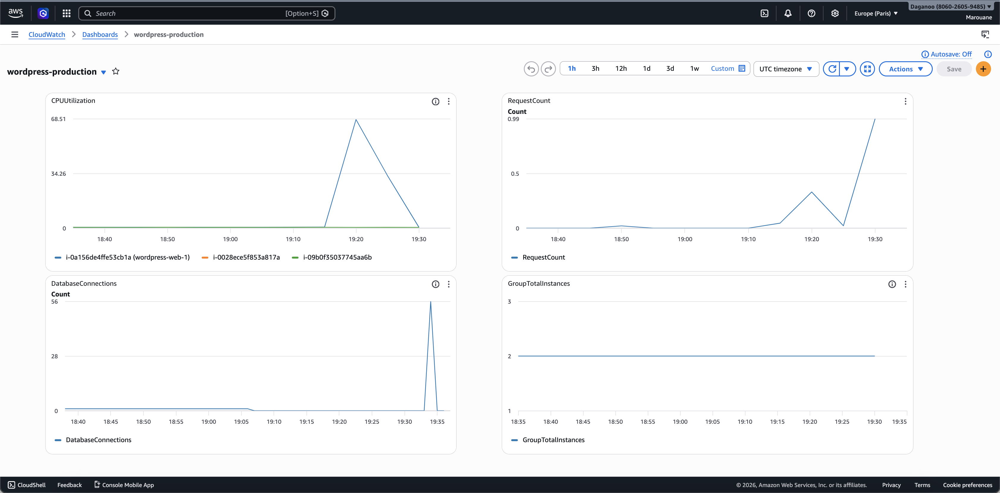

**ASG activity log — exact moment scaling was triggered and new instance launched:**
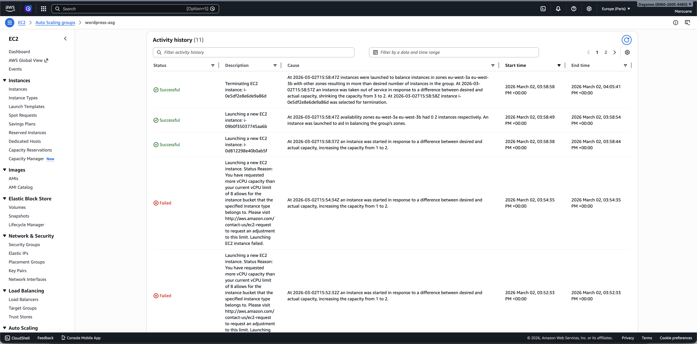

---

## 🧠 What I Learned

### AWS Services

- **VPC Design** — How to architect private networks with public/private subnet separation, route tables, and internet gateways. I now understand why every production system starts with a custom VPC instead of using the default one.
- **Security Groups** — Implementing defense in depth with layered firewall rules. The key insight: each layer should only accept traffic from the layer directly above it, nothing else.
- **RDS Multi-AZ** — How AWS handles automatic database failover and why the standby replica is worth the extra cost in production. It's invisible until you need it.
- **EFS vs EBS** — When to use shared network storage vs local block storage. For stateless web servers that need to share files, EFS is the right answer.
- **Auto Scaling** — Target tracking policies, cooldown periods, and how CloudWatch metrics trigger scaling actions. The difference between desired, minimum, and maximum capacity.
- **ALB** — Health checks, target groups, listener rules, and how the load balancer decides where to route each request.

### Real-World Concepts

- **Defense in Depth** — Multiple security layers so a breach at one layer doesn't expose everything. The database should never be reachable from the internet directly.
- **Horizontal vs Vertical Scaling** — Why adding more servers is more reliable and cost-effective than making one server bigger.
- **Stateless Architecture** — Designing servers so any request can be handled by any server — the foundation that makes auto-scaling possible.
- **Infrastructure Cost Management** — AWS bills by the hour. NAT Gateway charges even when idle. I learned to check the billing dashboard daily.

### Challenges I Hit

- **EFS NFS permissions** — Mounting failed until I added port 2049 inbound rule to webserver-sg. Easy fix once I understood NFS requires its own dedicated port.
- **RDS Multi-AZ cluster vs instance** — The cluster option requires 3 AZs but my subnet group only had 2 private subnets. Switching to the "instance" option solved it immediately.
- **vCPU account limits** — During load testing, Auto Scaling tried to launch more instances but hit AWS's default vCPU quota for new accounts. The architecture was correct — it was purely an account limit. Requesting an increase via AWS Support resolves this.
- **WordPress HTTPS** — ACM SSL certificate validation requires adding a CNAME record to your domain's DNS. Free subdomains don't support custom DNS records, so a real domain is needed for full SSL setup.

---

## 🔮 Future Improvements

- [ ] Add **Route 53** with custom domain and DNS health checks
- [ ] Configure **ACM SSL certificate** for HTTPS
- [ ] Implement **ElastiCache (Redis)** for WordPress object caching
- [ ] Add **WAF** (Web Application Firewall) for DDoS protection
- [ ] Set up **CI/CD pipeline** with CodeDeploy for zero-downtime deployments
- [ ] Implement **S3 + CloudFront** CDN for static assets
- [ ] Add **AWS Backup** for cross-region disaster recovery
- [ ] Configure **VPC Flow Logs** for network traffic auditing

---

## 👨‍💻 Author

**Marouane Dagana**

- 💼 LinkedIn: [linkedin.com/in/marouane-dagana](https://linkedin.com/in/marouane-dagana-418832264)
- 🐙 GitHub: [@daganoo](https://github.com/daganoo)
- 📧 Email: marwan.dagana@gmail.com

---

## 📄 License

This project is open source and available under the [MIT License](LICENSE).

---

<div align="center">

**⭐ Built on AWS · Documented for the community**

</div>
